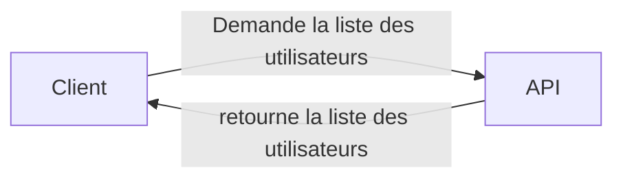
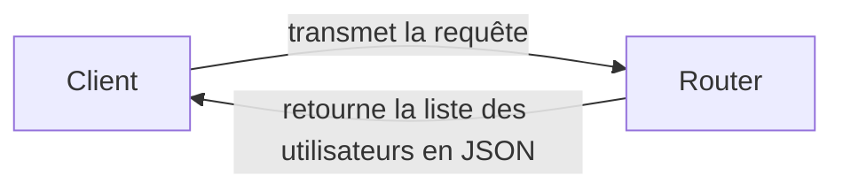
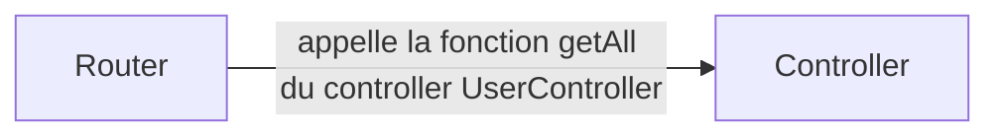
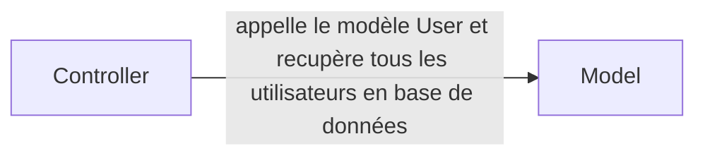
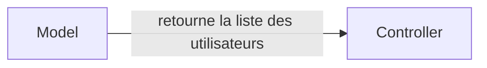
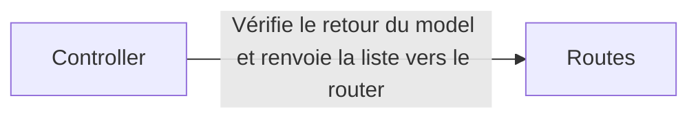
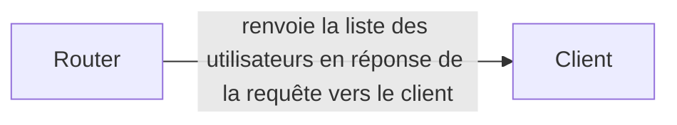

# Ce projet est l'API de Cloudify

Cette API nous permet de centraliser tous les traitements complexe et les requêtes à la base de données. Nous avons réfléchi à une structure cohérente et optimale pour ce projet.

# Models

Il est conseillé de travailler avec un ORM pour les communications avec la base de données choisi. Nous utilisons une base **MongoDB** donc nous nous sommes tourné vers **Mongoose**. Si vous souhaitez utiliser du **SQL**, comme par exemple le SGBD Mysql, nous vous conseillons **Sequelize** si vous travaillez en Javascript et **TypeORM** si vous travaillez en **Typescript**.

Le dossiers **Models** doit contenir les Models de l'ORM choisi. Un model est une modélisation d'un table de la base de données en objet.

## Controllers

Nous utilisons une structure qui sépare les différentes traitements, chaque module a sa tâche. Ici les controllers servent à faire tous les traitements complexes de l'API. Les méthodes du controller seront appelés, en général, depuis les routes dont nous parleront dans la section suivante.

## Routes

Pour gérer le routing nous utilisons le framework Express. Il simplifie la gestion des routes. 
Une route qu'est ce que c'est ? comme dirait [Wikipédia](https://fr.wikipedia.org/wiki/Routage) : 

> Le **routage** est le mécanisme par lequel des chemins sont
> sélectionnés dans un réseau pour acheminer les données d'un expéditeur
> jusqu'à un ou plusieurs destinataires

Nous créons des routes que nous redirigerons vers les méthodes de nos controllers.

## Sockets

Cette parti n'est pas implémentée pour la partie WEB

## Helpers

Dans ce dossier nous avons créé toutes nos classes et fonctions dont nous avions besoin pour simplifier le code et qui n'avaient donc rien a faire dans les controllers ou autre parties du projet.

## Config

Le dossier **config** permet de configurer notre base de données et tout autre **library** à configurer.

## Résumé

### La requête du client (Angular par exemple) vers l'API : 

### La requête Gérer par le router (Express par exemple) dans l'API : 

***Phase 1 :***

***Phase 2:***

***Phase 3:***

***Phase 4:***

***Phase 5:***

***Phase 6:***

